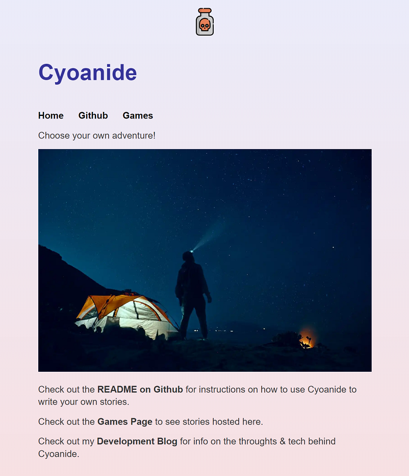
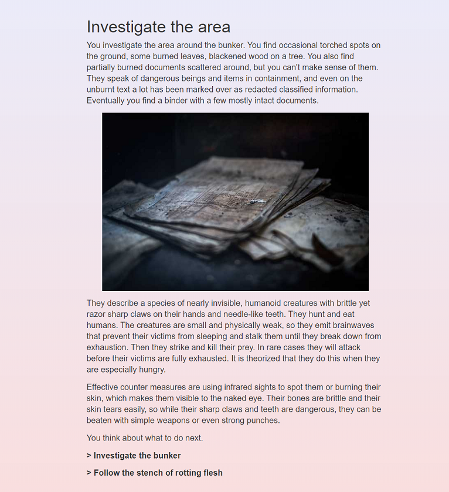

I built an open source Choose Your Own Adventure "engine" called Cyoanide with Gatsby. This is its story.

[Cyoanide Github repository](https://github.com/Odin94/Cyoanide)

[Cyoanide Demo Website](https://www.cyoanide.odin-matthias.de)



## What I built

Cyoanide uses static site generation to let you create Choose Your Own Adventure (CYOA) games that run in the browser and don't require a backend server. It lets you write Markdown pages which each represent a scene and contain links to other scenes the way a CYOA book directs you to change to page 10 for choice A and page 22 for choice B. 

It functions like a Gatsby starter, which means you use it as a starting project for your Gatsby-powered static website and you can modify the design and add content in the form of markdown documents. I use the word "engine" in quotation marks to describe Cyoanide because unlike "normal game engines" you build your game in code through a text editor and it is expected that you modify the engine to eg. change the design of your scenes. (Although that is optional, you can use Cyoanide without any tech skills beyond writing Markdown text and running `npm build` in your terminal, which anyone can learn in a few minutes)

Cyoanide comes with a clean, minimal default design. It lets you use React components and Javascript code in your Markdown files(using [MDX](https://mdxjs.com)) to include game logic beyond what simple Markdown rendering would allow. It also comes with configurations and helper functions to play background music and access all decisions that the player has made in your game. This history of player decisions allows for further reaching consequences of player choice than a CYOA book can provide as your decisions not only impact the next page you turn to, but could potentially have an effect 5 scenes down the path.

Once you are happy with your story you can either distribute it as a website or as Desktop application. (with caveats, see chapter [What got in my way](#what-got-in-my-way))




## Why I built it

I mostly built it as a fun project; something with a small scope that I could reasonably finish while also providing some value. Finishing software projects is hard for me and I have dozens of unfinished games, tools and web projects sitting in my Github. Cyoanide may well be the first project I actually completed (for some definition of complete).

I also built it as a motivator to get me (back) into creative writing, something I used to do a lot when I was younger and part of a group that regularly met up to present their writing and give each other feedback. I haven't done much writing since that group split up years ago. I suppose this blog post also counts as writing, so that's nice :)  I'm specifically choosing a CYOA engine for creative writing since I deeply enjoy Pen & Paper RPGs (shoutout to [Heart - The City Beneath](https://rowanrookanddecard.com/product/heart-the-city-beneath-rpg/)) and CYOA games are fairly similar to RPGs; they satisfy some of the same itch of experiencing a story you can influence as a player, and telling a story with a collaborative element as "Dungeon Master".

There already exists a CYOA engine that outputs static HTML pages called [Twine](https://twinery.org). Cyoanide can't compete with regards to scope and polish. However, Cyoanide has some distinct advantages over Twine:

* You can write your story in a nice text editor, like [Visual Studio Code](https://code.visualstudio.com), without external tools (see [Tweego](http://www.motoslave.net/tweego/) for Twine)
* Your story is easy to manage (copy, backup, import into other tools) since it's all just folders and Markdown files
* You can include React components in your story
* Maybe more js/css/html customization..? Not sure how much Twine can do here


## How I built it

First, this is the tech I used:

I chose a web technology because it comes with many benefits:
* Easy to distribute & demo
* Easy-ish to make interfaces (compared to many other tools)
* Made for the task of displaying Hypermedia-text that links to other Hypermedia-text, which is all a Choose Your Own Adventure game is
* Can be slapped into electron if desktop-distribution is desired & performance doesn't matter

As framework I choose the [Gatsby](https://www.gatsbyjs.com) static site generator; mostly because I was already somewhat familiar with it and because I like react. It provides a bunch of nice features out of the box, like optimized image loading, single-page-routing and of course generating templated pages from Markdown.

It also comes with an [MDX](https://mdxjs.com) plugin that lets you add JSX components and some JS to your Markdown. I'm using this to load the path that the user has taken from the browsers local storage and offer different choices based on past decisions. It also opens the door for adding dynamic animations, sound effects, auto-scrolling (like the infamous Bongcheon-Dong Ghost) etc. in the future (not planned atm).

I chose typescript over plain javascript mostly because I like typescript. There's very little benefit from types in this project because the codebase is fairly small and not that complex.

I chose [Netlify](https://www.netlify.com) for free static page hosting + automatic deploys whenever I push to my `main` branch on Github.

I chose Electron to turn the web app into a desktop application because.. what competitors are there, really? ;)

Second, these are the features and how I built them:

**Building a story from inter-linking Markdown pages:** With the `{mdx.frontmatter__slug}.tsx` file, Gatsby generates pages based on the `slug` attribute in each Markdown file's `frontmatter` with the respective `slug` as name/url. Within the Markdown files users can put links to other Markdown files based on the frontmatter. Basic Markdown-links work, but reload the page to navigate. For that reason, I recommend to use Gatsby `<Link>` tags to navigate without reloading the page.

**Reacting to the chosen path:** Every time a Markdown-page is opened, a function (`saveLevelState`) is triggered that checks if this is the first time the user visits the page. If yes, the page's `slug` is added to a list in the browsers local storage. Otherwise, all `slugs` that come after in the list are erased. This system keeps track of the players progression through the story and always keeps an accurate path, even if the user undoes an action by hitting the browser's `navigate back` button (the stored path may become inaccurate if the player uses more than one browser tab). The stored path can be queried in MDX and with simple ternary logic it can conditionally render text, links, images etc. based on the players past choices.

```JS
// Only show the option to investigate the bunker if the player hasn't done so yet
{!getLevelState().includes("investigate-bunker") ? <Link to="../investigate-bunker">{"> Investigate the bunker"}</Link> : null }
```

**Loading games:** When the player navigates to `/game`, the Cyoanide checks local storage for a saved game state. If one exists a modal opens and lets the user choose to load their game or delete save state. Loading a game just navigates to the latest `slug` stored in the state. On top of allowing players to pick up where they left off, this system also aims to prevent corrupted save states from players playing several games at the same time and having their game state contain mixed `slugs` from those different games.

**Playing music:** You can add a path to a music file to your Markdown page's `frontmatter` like `music: "./scary-forest-90162.mp3"` and it will be played in a loop while the player is on that page. If no music is set on a page, all music will be stopped. If the next page has the same music set, the music will continue playing rather than restart. I'm using the [Howler.js](https://howlerjs.com) library for playing music which comes with a global object that contains all playing audio across pages, which makes it easy to compare currently playing audio sources from different pages.

**Showing game entry points:** Currently, a hosted instance of Cyoanide supports multiple games/stories, which can be selected on the `/game` page. Entrypoints to a story are functionally the same as any other page in a story, but to let Cyoanide identify which one is an entrypoint, the `/game` page filters by Markdown pages which contain `story_start: true` in their `frontmatter`.


## What got in my way

* Gatsby is surprisingly complex and unintuitive for building simple static pages. You have to learn how to use `gatsby-config.ts`, the plugin system (that one is not so hard), `gatsby-node.ts` (which took me some time to learn that I could straight up ignore it), the node system and how to query it with graphql and how to use that queried data. If I were to start again, maybe I'd look for a simpler framework that works with a flat file system rather than nodes.
 
* MDX only works ok-ish-ly with free-form js. It lets you run only oneliners, similar to the rendering part of JSX. So if you want to display different choices to the user based on whether they have already taken two out of three paths or not, you can **NOT** do this:

```JS
const levelState = getLevelState()

const seenBunkerActions = ["investigate-bunker", "keep-your-distance", "follow-stench"].filter((it) => levelState.includes(it))

seenBunkerActions.length > 2 ? <>...</> : <>...</>
```

But requires you to write this:

```JS
["investigate-bunker", "keep-your-distance", "follow-stench"].filter((it) => getLevelState().includes(it)).length >= 2 ? <>...</> : <>...</>
```

* Gatsby doesn't play very nicely with Electron. I'm going to quote the rant about this that I put in the README:

> Unfortunately Gatsby doesn't play nicely with relative links, which is what is required to access files in the bundled Electron application. See [this discussion](https://github.com/gatsbyjs/gatsby/discussions/14161). Using `gatsby-plugin-ipfs` I could almost make it work, since this plugin allows to use proper relative paths. With this, Electron goes to the right paths (meaning `./game` rather than `C://game`), but doesn't load the `index.html` files in these paths. One way to fix this is to manually add `/index.html` to all Gatsby `<Link>` tags, which will actually make it work. I'm not happy with the solution and since this is just a hobby project and I have no need to deploy to Electron, I'll leave it at this. A possible fix is to extend what `gatsby-plugin-ipfs` does in its `gatsby-node.js` to automatically add `/index.html` to all links. Or maybe Gatsby fixes its config some day.

## Potential future improvements
* Support level state saves for multiple games and overwrite-warnings
* Make design changes easier (support theming for individual pages/scenes?)
* Export build output outside of the Cyoanide website as standalone games (with their own cover art / main page setup etc.)
* Fully support "browserless" desktop builds with Electron without hacky workarounds
